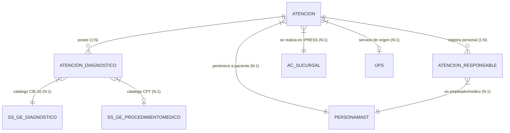

# Documentación de Contexto y Modelo de Datos - Base de Datos `sgcoresys`

## 1. Visión General
- **Motor de Base de Datos:** MariaDB 11.x
- **Nombre de Base de Datos:** `sgcoresys`
- **Propósito:** Registro y gestión asistencial de atenciones médicas, diagnósticos (CIE-10), procedimientos (CPT), pacientes, personal responsable y establecimientos de salud (IPRESS).

---

## 2. Diagrama de Relaciones Implícitas (ERD)

---

## 3. Mapeo de Procedimientos (CPMS) y Diagnósticos (CIE-10) de Tamizaje

### Procedimientos (CPMS):
- `57452`: Colposcopia de Cérvix incluyendo la parte superior o Adyacente de la Vagina.
- `57500`: Biopsia de cuello uterino.
- `77057`: Mamografía Bilateral de Tamizaje.
- `82270`: Test Sangre Oculta en Heces.
- `84152`: Examen de Antígeno Prostático (PSA).
- `87621`: Detección Molecular VPH.
- `88141`: Citopatología Cervicovaginal o Vaginal (Papanicolaou).
- `88141.01`: Inspección Visual con Ácido Acético (IVAA).
- `99386.03`: Examen Clínico de Mama.

### Diagnósticos (CIE-10):
- `C53.9`: Tumor Maligno del Cuello del Útero sin otra especificación.
- `D06.9`: Carcinoma In Situ del Cuello del Útero / Neoplasia Intraepitelial.
- `N63.X`: Masa no Especificada en la Mama.
- `N87.0`: Displasia Cervical Leve / NIC 1.
- `N87.1`: Displasia Cervical Moderada / NIC 2.
- `N87.2`: Displasia Cervical Severa / NIC 3.
- `R87.6`: Hallazgos Anormales en Frotis / Citología PAP.
- `Z12.8`: Examen Clínico de Piel (Pesquisa especial).

---

## 4. Clasificación de Beneficiarios y Sexo
- **Tipo de Beneficiario:**
  - `'TITULAR'`: `ID_BENEFICIARIO IN ('1', '01')`
  - `'DERECHOHABIENTE'`: Resto de valores de `ID_BENEFICIARIO`
- **Sexo:** `'MASCULINO'`, `'FEMENINO'`
