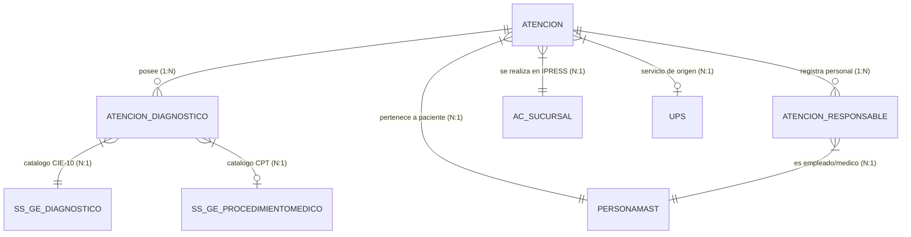

# Documentación de Contexto y Modelo de Datos - Base de Datos `sgcoresys`

## 1. Visión General
- **Motor de Base de Datos:** MariaDB 11.x
- **Nombre de Base de Datos:** `sgcoresys`
- **Propósito:** Registro y gestión asistencial de atenciones médicas, diagnósticos (CIE-10), procedimientos (CPT), pacientes, personal responsable y establecimientos de salud (IPRESS).

---

## 2. Diagrama de Relaciones Implícitas (ERD)

---

## 3. Mapeo de Categorías y Grupos de Cáncer Evaluados

| Grupo del reporte | Códigos CIE-10 en la BD (`LNN`) |
| :--- | :--- |
| **CÁNCER DE MAMA** | `C50` |
| **CÁNCER DE COLON** | `C18` |
| **CÁNCER DE ESTÓMAGO** | `C16` |
| **CÁNCER DE PULMÓN** | `C34` |
| **CÁNCER DE CUELLO UTERINO** | `C53` |
| **MELANOMA** | `C43` |
| **CÁNCER DE RECTO** | `C20` |
| **CÁNCER DE HÍGADO** | `C22` |
| **CÁNCER DE PIEL NO MELANOMA** | `C44` |
| **CÁNCER DE PRÓSTATA** | `C61` |
| **LINFOMA** | `C81`, `C82`, `C83`, `C84`, `C85`, `C86` |
| **MIELOMA MÚLTIPLE** | `C90` |
| **LEUCEMIA** | `C91`, `C92`, `C93`, `C94`, `C95` |

---

## 4. Diccionario de Tablas Principales

### 4.1. `atencion` (Tabla Central de Atenciones)
- **`id_atencion`** *(Primary Key)*: Identificador único de la atención.
- **`id_tipo_atencion`**: Tipo de atención prestada (`'AM'`: Ambulatoria, `'EM'`: Emergencia, `'HO'`: Hospitalización, `'PR'`: Procedimientos).
- **`paciente_id`**: Identificador de la persona (Cruce con `personamast.persona`).
- **`ID_IPRESS`**: Código de la IPRESS / Sucursal (Cruce con `ac_sucursal.SUCURSAL` / `CODIGOIPRESS`).
- **`FECHA_ATENCION`** *(DATETIME)*: Fecha y hora exacta de la atención.
- **`ID_PERIODO`** *(VARCHAR)*: Periodo de la atención en formato `YYYYMM` (ej. `'202501'`).
- **`ESTADO`**: Estado del registro (`'A'` = Activo, `'I'` = Inactivo).

### 4.2. `atencion_diagnostico` (Detalle de Diagnósticos y Procedimientos)
- **`id_atencion`**: Llave foránea a `atencion.id_atencion`.
- **`id_diagnostico`**: Llave foránea a `ss_ge_diagnostico.idDiagnostico`.
- **`id_tipo_diagnostico`**: Tipo de diagnóstico (`'01'` Presuntivo, `'02'` Definitivo, `'03'` Repetido, etc.).
- **`ID_TIPO_DETALLE`**: `'DIA'` (Diagnóstico), `'PRO'` (Procedimiento), `'QUI'` (Quirúrgico).

---

## 5. Consideraciones sobre Conteo de ATENDIDOS vs ATENCIONES

> [!WARNING]
> **Duplicidad de Atendidos al Sumar Subcategorías / Tipos de Dx en Excel:**
> Si un paciente recibe múltiples registros de diagnósticos o subcategorías en un mismo año:
> 1. En Excel / Tabla Dinámica se recomienda usar la **Data General (Opción 1)** aplicando **"Recuento Distinto" (Distinct Count)** sobre la columna `DNI` (Atendidos) o `ID_ATENCION` (Atenciones).
> 2. En SQL directo se recomienda usar la consulta de la **Opción 2** agrupada por `LEFT(dx.CodigoDiagnostico, 3)` con `COUNT(DISTINCT p.documento)`.
